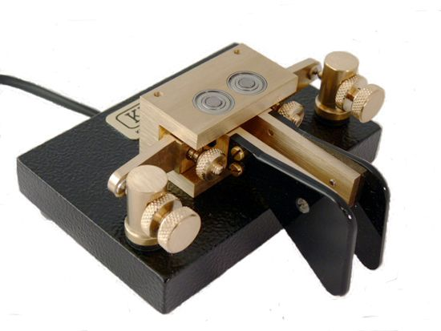

# cwtrainer
_Morse code trainer_

## Use
This program helps you to learn morse code. The above text field contains words (tokens), the lower
text input shows the keyed in morse characters. The properly inputed letters appear in green, the mistakes appear in red.

Default key configuration:
- S: single key (read below [Keying methods](#keying-methods) )
- F: dots key
- G: dashes key
- H: help key, this plays the current token on the beeper
- D: delete key, this moves the cursor back by one character

## About morse
The morse code consists of a number of different symbols. Morse code is primarily an audio sign system, that means that each symbol has its assigned lengths. Nevertheless each symbol can be transcribed as well. Here is a little description of each:
- The dot '.' is the short beep, this is also our unit of measurement. It has a length of one dot.
- The dash '-' is the long beep, this has a length of three dots.
- After each letter there is a silence of 3 dots, this gets transcribed as a space ' '.
- After each word there is a silence equivalent of 7 dots, this gets transcribed as a space, a dash and a space ' / '

## Keying methods
There are two main methods of keying morse code, the single key method and the two key methods.
With the single key method there is one key, wich gets repeatedly pressed down for longer or shorter periods, and this creates the morse symbols.

With the two keys method there is a dedicated key for dots, and another key for dashes. There is no need to repeatedly press the keys, because just by holding down one of the keys the appropriate signals will be repeatedly generated with a prespecified frequency.

_traditional morse key_

_dual lever morse key_

## Configuration
The program is configured by the `cwtrainer.config.json` file. Here are some important settings that one might one to change:
- dotLength (default: 150) this sets the time length unit for all symbols
- defaultDifficulty (default 0) this sets which dictionary file will be used by the program

## Dictionaries
The program can use custom dictionaries that have a file name of `dictionary_[code].csv`. The [code] is the code of the difficulty level, that is set by `defaultDifficulty` configuration parameter. The 0,1,2 codes are used for easy, medium and hard in that order, but further levels and dictionaries can be specified as well.

